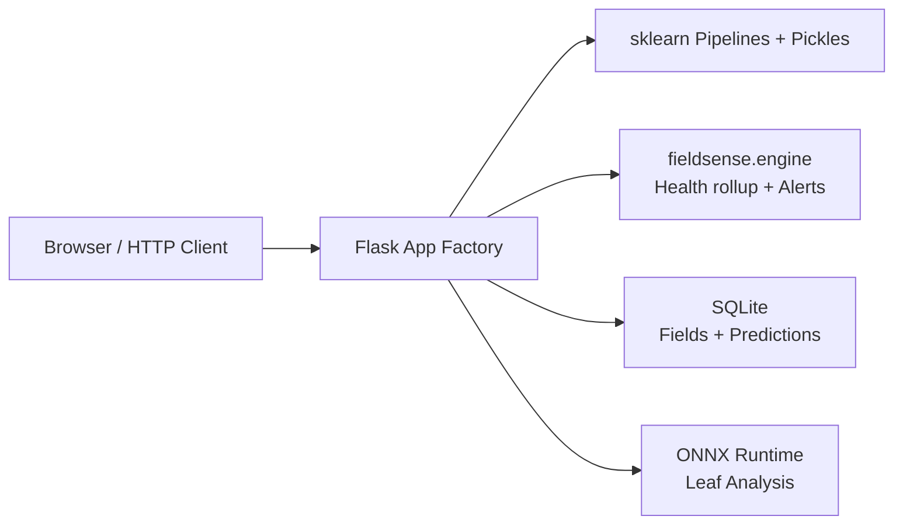

# FieldSense

**Structured agronomy assistance** from tabular field data and optional leaf imagery — with a clean API, audit trail, and explicit uncertainty boundaries.

[](https://github.com/rsd-darshan/FieldSense/actions/workflows/ci.yml)

**Live Demo**: [fieldsense-ai-platform.vercel.app](https://fieldsense-ai-platform.vercel.app)

---

## Who It's For

FieldSense is built for:
- **Agritech Product Managers** evaluating domain-specific AI products
- **ML Engineers** exploring agriculture verticals
- **Researchers and technical evaluators** who want a credible, production-shaped demo - not just another Jupyter notebook

It demonstrates how classical ML, lightweight computer vision, and well-designed APIs can come together into a repeatable, auditable decision support tool.

---

## The Problem

Farm-level decisions require **repeatable inputs**, **explainable outputs**, and **decision history**.
Spreadsheets and one-off models fall short - they do not provide versioned predictions tied to specific fields, nor easy export for review and audit.

---

## What FieldSense Does

Enter soil nutrients (N, P, K), weather, and soil context - and optionally a leaf photo - and get:

- Crop suitability prediction
- Fertilizer recommendations
- Unified intelligence rollup: health score, risk band, flagged issues, and recommended actions

All predictions are **persisted per field** with full history and CSV export support.

---

## What Makes It Stand Out

| Strength | Honest Limitation |
|----------|-------------------|
| Full REST API + minimal SSR UI | Not a regulatory or certified agronomic tool - all outputs require human validation |
| SQLite-backed history + CSV export | Serverless SQLite is ephemeral (use external DB for production durability) |
| Clean separation: `fieldsense.engine` library vs web app | Pickled sklearn models carry version drift risk |
| Lightweight leaf model via ONNX (~50MB) instead of heavy PyTorch | Git LFS required for model weights |
| Transparent feature usage in every prediction | - |

---

## Architecture



**Request flow example (crop prediction)**:
Resolve field -> Build feature vector -> Run model -> Compute deterministic intelligence rollup -> Persist prediction

---

## Repository Structure

```bash
FieldSense/
├── api/                 # Vercel serverless entrypoint
├── app/                 # Flask app, routes, templates, static files and model weights
├── src/fieldsense/      # Installable Python library (core engine + model registry)
├── data/                # Documented datasets
├── experiments/         # Training and evaluation notebooks/scripts
├── docs/                # Methodology, model cards, architecture
├── tests/               # pytest suite
└── config/              # Environment and deployment configs
```

---

## Quick Start

```bash
python -m venv .venv
source .venv/bin/activate
pip install -r requirements-dev.txt

git lfs install && git lfs pull

cd app && PORT=5050 python app.py
```

Open http://127.0.0.1:5050

**Note**: Leaf model runs via `onnxruntime` by default. Regenerate ONNX with `python scripts/export_leaf_onnx.py` if needed.

---

## Running Tests

```bash
python -m pytest tests/ -v
```

---

## Tech Stack (and Why)

- **Flask** - Lightweight, readable, and maps cleanly to Vercel serverless
- **scikit-learn** - Standard for tabular agronomy baselines
- **ONNX Runtime** - Lightweight inference for the leaf model
- **SQLite** - Zero-config persistence for demo purposes
- **Vercel** - One-command deployment for easy evaluation

---

## Future Improvements

1. Replace pickled models with ONNX + strict version locking
2. Move to managed Postgres + Alembic migrations for durable history
3. Add authentication and field-level access control
4. Extract leaf model into an optional GPU microservice
5. Add OpenAPI contract tests for better API stability

---

## Important Disclaimers

**FieldSense is a research prototype.**
Its outputs are **not agronomic, veterinary, or regulatory advice**. Always validate recommendations with qualified experts and follow local regulations.

See `docs/TRUST_AND_SAFETY.md` and `docs/methodology.md` for deeper details.
